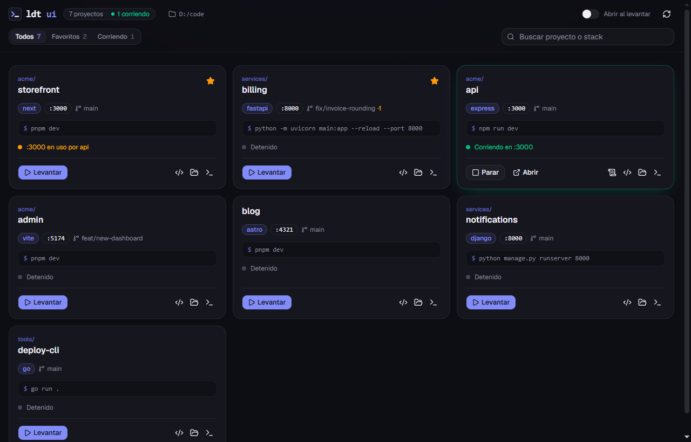

# Lumel Devtools UI

Panel de escritorio para levantar los proyectos de desarrollo de una carpeta con un clic:
ver qué hay, qué corre y en qué puerto, levantar y parar, abrir en el navegador, en la
terminal o en VS Code, y seguir los logs en vivo.

Es la cara humana de [`ldt`](https://github.com/lumel-dev/ldt): toda la detección y el
manejo de procesos los hace `ldt`, y lo que la UI levanta es lo mismo que ven `ldt status`
y los agentes de código.



## Instalación

Los instaladores están en la [última release](https://github.com/lumel-dev/ldt-ui/releases/latest).
La app ya viene compilada: para usarla no hace falta Node ni Rust.

En los tres sistemas necesita [`ldt`](https://github.com/lumel-dev/ldt) instalado, con su
instalador (`install.ps1` en Windows, `install.sh` en Linux y macOS), porque la app no
hace nada por su cuenta: todo se lo pide a `ldt`. Eso a su vez pide Python 3.10+; el
README de `ldt` tiene el detalle. Los proyectos que levantes necesitan lo suyo (Node,
Python, Go…), igual que si los levantaras a mano.

Los instaladores no están firmados con un certificado de desarrollador, así que la
primera vez el sistema pide confirmar. Abajo está cómo, en cada caso.

### Windows

**Requisitos:** Windows 10 u 11 de 64 bits. WebView2 ya viene con el sistema.

- `ldt-ui_<versión>_x64-setup.exe`: instala para tu usuario, sin permisos de administrador.
- `ldt-ui_<versión>_x64_en-US.msi`: lo mismo en formato MSI, para instalar en la máquina.

Si SmartScreen avisa: "Más información" → "Ejecutar de todas formas".

### macOS

**Requisitos:** macOS 10.13 o posterior, Intel o Apple Silicon (el mismo archivo sirve
para los dos).

1. Abrí `ldt-ui_<versión>_universal.dmg` y arrastrá **ldt-ui** a Aplicaciones.
2. La primera vez macOS la bloquea ("no se puede abrir porque Apple no puede comprobar…").
   Andá a **Configuración del Sistema → Privacidad y seguridad** y, abajo de todo, tocá
   **Abrir igualmente**. O, desde la terminal:

   ```sh
   xattr -dr com.apple.quarantine /Applications/ldt-ui.app
   ```

Para el botón de VS Code no hace falta el comando `code`: si no está, se abre la app.

### Linux

**Requisitos:** x86_64 con glibc 2.35 o posterior (Ubuntu 22.04+, Debian 12+, Fedora
36+ y derivadas) y un escritorio gráfico.

- **Debian, Ubuntu, Mint, Pop!_OS:** el `.deb`. `apt` instala también WebKitGTK.

  ```sh
  sudo apt install ./ldt-ui_<versión>_amd64.deb
  ```

- **Fedora, RHEL, openSUSE:** el `.rpm`.

  ```sh
  sudo dnf install ./ldt-ui-<versión>-1.x86_64.rpm
  ```

- **Cualquier otra:** el `.AppImage`, que trae sus propias librerías y no se instala.

  ```sh
  chmod +x ldt-ui_<versión>_amd64.AppImage
  ./ldt-ui_<versión>_amd64.AppImage
  ```

  Necesita FUSE 2 (`libfuse2` en Ubuntu/Debian, `fuse-libs` en Fedora). Sin FUSE se
  puede correr con `--appimage-extract-and-run`.

El botón de terminal usa `$TERMINAL` si está definida; si no, busca la del escritorio
(GNOME Terminal, Konsole, Xfce, kitty, Alacritty, WezTerm, foot o xterm).

La app toma el PATH de tu shell de login al abrir, así que encuentra `ldt` y tus
herramientas aunque la abras desde el menú del escritorio o el Dock.

## Uso

La primera vez pide la carpeta de trabajo (por ejemplo `~/code` o `D:/Repos`). Se recorre
con `ldt scan --all`, hasta tres niveles de profundidad. La carpeta, los favoritos y el uso
reciente quedan en el `localStorage` de la app; nada sale de la máquina.

| Variable      | Para qué                                                          |
| ------------- | ----------------------------------------------------------------- |
| `LDT_PY`      | ruta a `ldt.py`, si `ldt` no está en el PATH                      |
| `LDT_PYTHON`  | el intérprete con que se corre (`python` / `python3` por defecto) |

## Compilar desde el código

Sólo si querés modificar la app o generar tus propios instaladores. Además de `ldt` hace
falta:

- Node 20+ y pnpm.
- Rust ([rustup](https://rustup.rs)).
- Lo de cada sistema:
  - **Windows:** las MSVC Build Tools con "Desarrollo para el escritorio con C++".
  - **macOS:** las Command Line Tools de Xcode (`xcode-select --install`).
  - **Linux (Debian/Ubuntu):**
    `sudo apt install libwebkit2gtk-4.1-dev libappindicator3-dev librsvg2-dev patchelf build-essential`.
    En otras distros, los mismos paquetes con su nombre; la
    [guía de Tauri](https://v2.tauri.app/start/prerequisites/) los lista.

```bash
pnpm install
pnpm dev            # sólo la UI, en el navegador (http://localhost:5173)
pnpm tauri dev      # la app de escritorio, con recarga en caliente
pnpm tauri build    # los instaladores del sistema en que corre, en src-tauri/target/release/bundle
```

Cada sistema compila sólo sus propios instaladores. Los de la release los arma GitHub
Actions (`.github/workflows/release.yml`) con un tag `v<versión>`.

Detalles de diseño y reglas para trabajar sobre el repo: [AGENTS.md](AGENTS.md).

## Licencia

MIT
